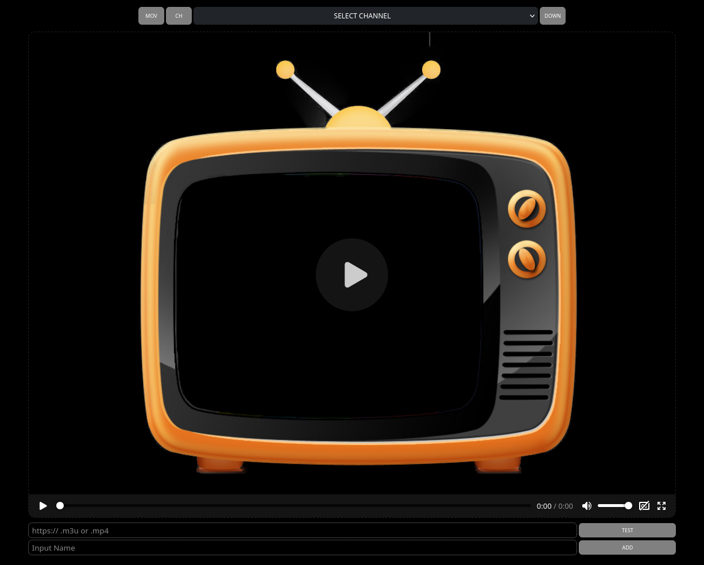

# Player Web to m3u and mp4 files.

---

## Contribuciones
Las contribuciones son bienvenidas. Si deseas mejorar el proyecto o añadir nuevas características, por favor realiza un fork y abre un pull request.

## Licencia
Este proyecto está bajo la Licencia MIT - consulta el archivo [LICENSE](LICENSE.md) para más detalles.
